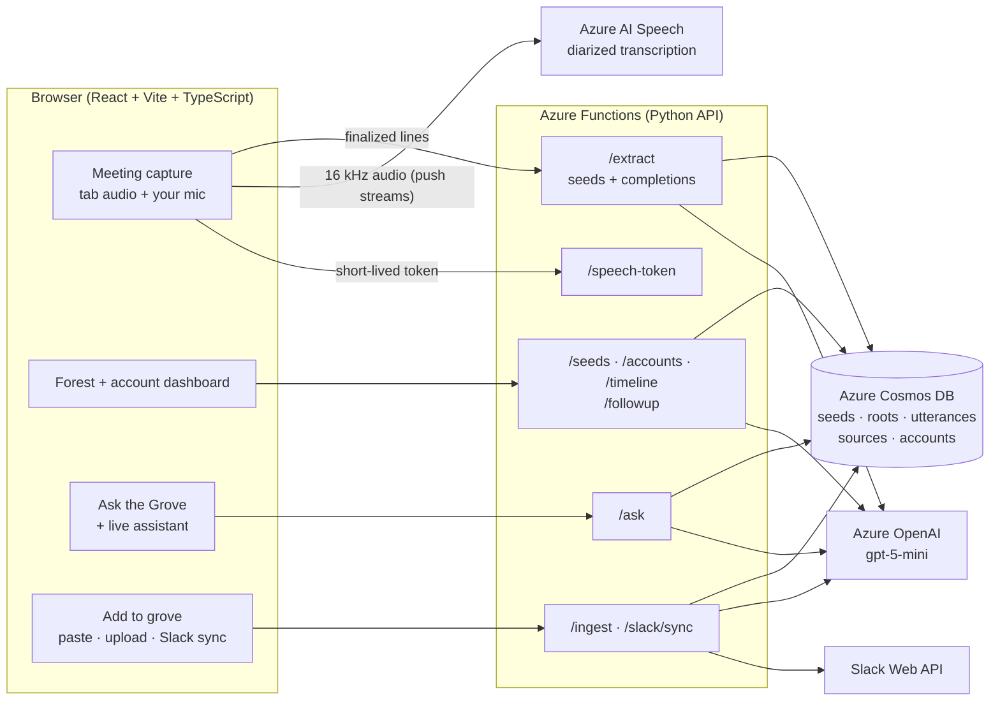

# Grovekeeper architecture

## Diagram

## Slide: "How Grovekeeper works"

**Browser → Azure Functions → Azure AI Speech, Azure OpenAI, Azure Cosmos DB, plus Slack**

- **Azure AI Speech:** live transcription of the shared meeting tab with speaker labels, and the
  user's own mic under their name. The browser only gets short-lived tokens; keys stay on the server.
- **Azure OpenAI (gpt-5-mini):** extracts commitments, decisions, risks and customer needs;
  spots "that's done"; plans and answers Ask the Grove questions; drafts follow-ups.
- **Azure Cosmos DB:** every seed with its quote, owner, deadline and source, per client account.
- **Azure Functions:** one Python API with typed contracts; every answer and seed traces back to
  a stored source.
- **Slack:** a read-only bot syncs linked channels into the right account.

**Trust by design:** verbatim quotes, no invented owners or deadlines, citations from stored
records, and a human Yes before anything is marked done.

## One request, end to end

1. You share a Meet tab. The browser streams 16 kHz audio straight to Azure AI Speech.
2. Each finalized line is saved (`/utterances`); every ~30 s of new speech goes to `/extract`.
3. gpt-5-mini returns candidate seeds and completions; the server keeps only items whose
   evidence is in the transcript, then saves them to Cosmos under the meeting's account.
4. The forest and account page show the new seeds; Ask the Grove can now cite them.
